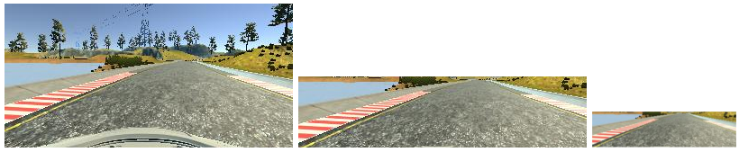

# Self-Driving Car Engineer Nanodegree: Behavioral Cloning

## Overview

In this project, a trained car drives in a simulated environment by cloning the behavior as seen during training mode.  Leveraging TensorFlow and Keras, a deep learning network predicts the proper steering angle given training examples.

## Dependencies

Install Python Dependencies with Anaconda (conda install …)
* numpy
* flask-socketio
* eventlet
* pillow
* h5py

Install Python Dependencies with pip (pip install ...)
* keras

## Files
* `model.py` - The script used to create and train the model.
* `drive.py` - The script to drive the car.
* `model.json` - The model architecture.
* `model.h5` - The model weights.

## Udacity Simulator

Udacity created a simulator based on the Unity engine that uses real game physics to create a close approximation to real driving.

### Download

* [Linux](https://d17h27t6h515a5.cloudfront.net/topher/2016/November/5831f0f7_simulator-linux/simulator-linux.zip)
* [macOS](https://d17h27t6h515a5.cloudfront.net/topher/2016/November/5831f290_simulator-macos/simulator-macos.zip)
* [Windows 32-bit](https://d17h27t6h515a5.cloudfront.net/topher/2016/November/5831f4b6_simulator-windows-32/simulator-windows-32.zip)
* [Windows 64-bit](https://d17h27t6h515a5.cloudfront.net/topher/2016/November/5831f3a4_simulator-windows-64/simulator-windows-64.zip)

Once you’ve downloaded it, extract it and run it.

### Run Server

Autonomous mode requires requires a server to receive steering commands.  Without the server not running, the car will just sit there in the simulated environment.

`python drive.py model.json`

## Network

### Approach

Transfer Learning
Bottleneck Features
NVIDIA Network

The README thoroughly discusses the approach taken for deriving and designing a model architecture fit for solving the given problem.

[nVidia Architecture](http://images.nvidia.com/content/tegra/automotive/images/2016/solutions/pdf/end-to-end-dl-using-px.pdf)

### Architecture

> The README provides sufficient details of the characteristics and qualities of the architecture, such as the type of model used, the number of layers, the size of each layer. Visualizations emphasizing particular qualities of the architecture are encouraged.

> The README describes how the model was trained and what the characteristics of the dataset are. Information such as how the dataset was generated and examples of images from the dataset should be included.

## Data Collection

In order to train our model to run in autonmous mode, we must first collect training data.


We start by recording while driving normally around the track a few times.  However, it is also helpful to record recovery data, where recording starts when you are turning away from the edge back to the center.

### Sample Images


## Training

#### Image Generator

The entire set of images used for training would consume a large amount of memory.  A python generator is leveraged so that only a single batch is contained in memory at a time.

#### Image Preprocessing

Image preprocessing is contained within the network pipeline.  This allows reuse so that no additional modifications are required within `drive.py`.

First the image is cropped above the horizon to reduce the amount of information the network is required to learn.  Next the image is resized to further reduce required processing.  Finally normalization is applied to each mini-batch.  This helps keep weight values small, improving numerical stability. In addition since our mean is relatively close to 0, the gradient descent optimization will have less searching to do when minimizing loss.



#### 

With the trained model, we can now run the simulator in autonomous mode.  Run the simulator in autonomous mode and start the driver server.

```
python drive.py model.json
```

The driver server sends predicted steering angles to the car using the trained network.  Here we can test how well the model performs.  If the car makes mistakes, we return to training mode to collect more training data.

